# 第二阶段rust for linux课程作业

## 实验环境：

vmware+ubuntu22.04

## 作业一：

1.编译内核架构

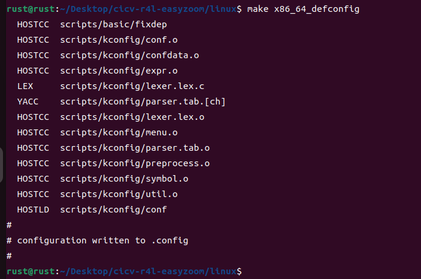

2.设置内核支持RUST

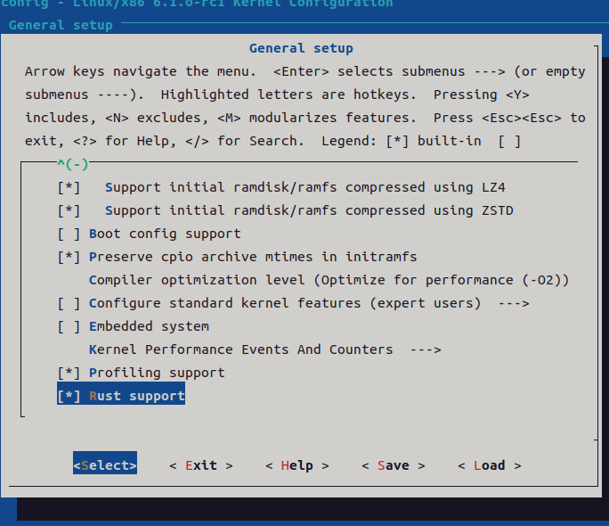

3.编译内核

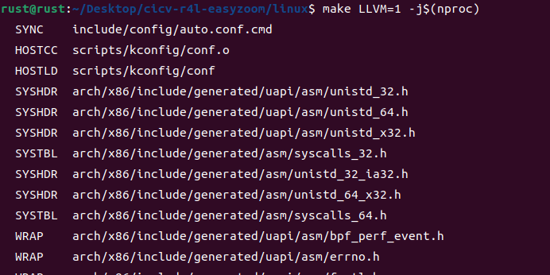

## 作业二：

### 问题解答:

1、编译成内核模块，是在哪个文件中以哪条语句定义的？
Kbuild的obj-m := r4l_e1000_demo.o

2、该模块位于独立的文件夹内，却能编译成Linux内核模块，这叫做out-of-tree module，请分析它是如何与内核代码产生联系的?
模块的Makefile需要引用Linux内核的编译系统和配置,并指定了KERNELDIR指向内核源代码树的位置,同时使用内核提供的网卡接口数据结构。编译生成的模块ko文件包含了对内核的引用信息。ko文件中的符号绑定和重定位信息会链接到内核代码。

### 实验内容:
1.编译网卡模块:

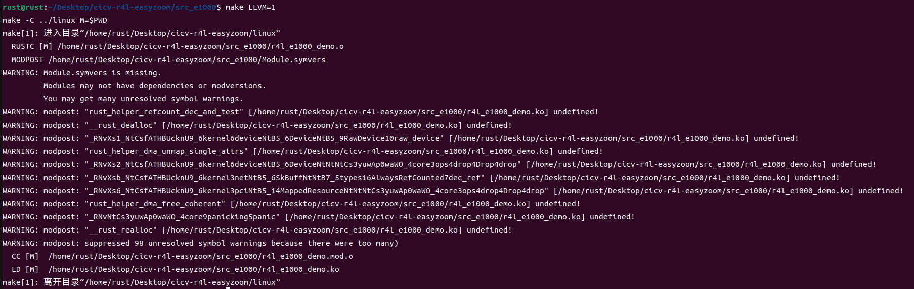

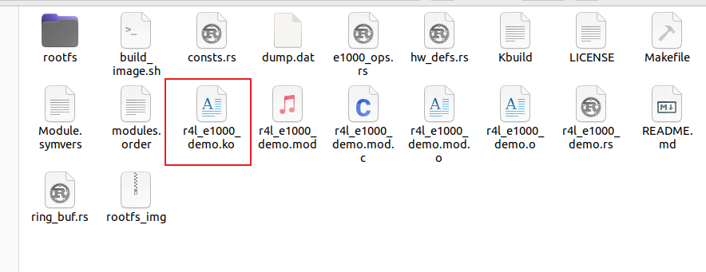

2.禁用C版本的e1000网卡驱动

3.qemu模拟器中加载r4l_e1000_demo.ko

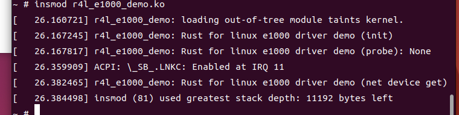

4.配置网卡

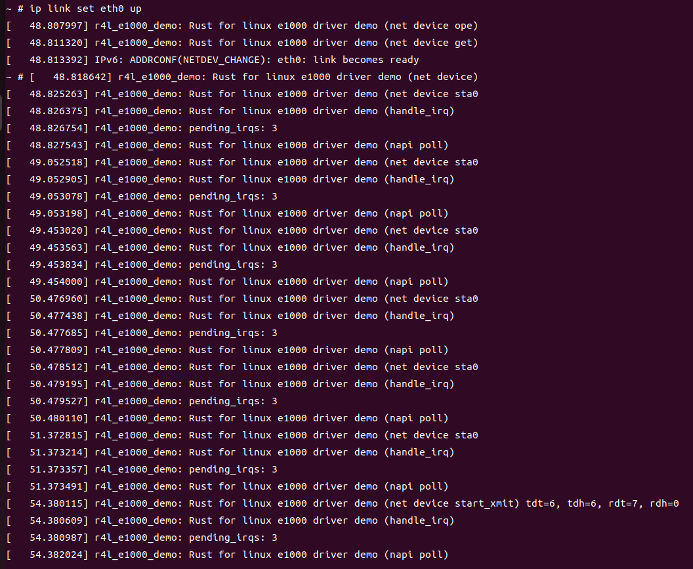

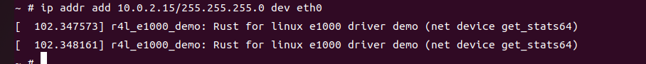

5.ping 10.0.2.2网络

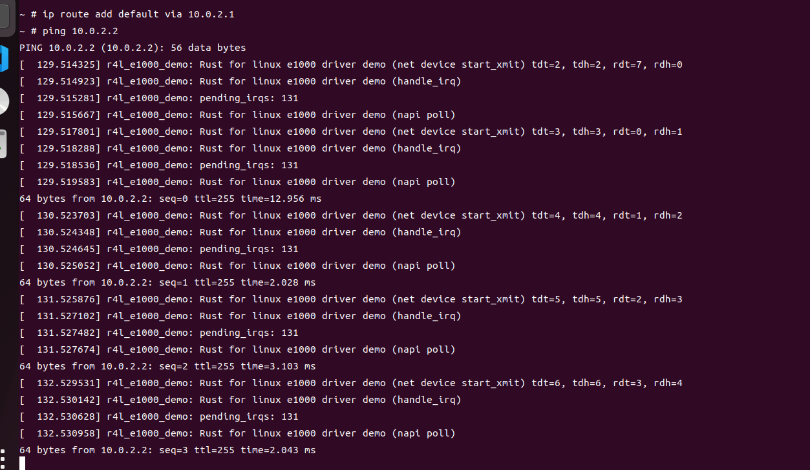

## 作业三：

添加rust_helloworld.rs并修改Makefile和Kconfig，编译内核架构

编译rust_helloworld.ko模块

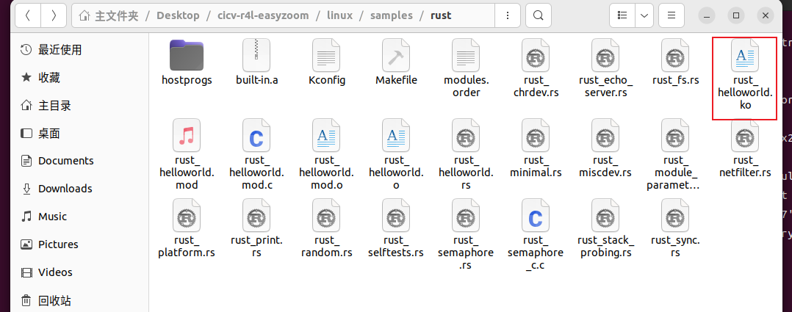

加载rust_helloworld.ko模块

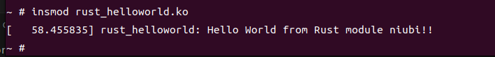