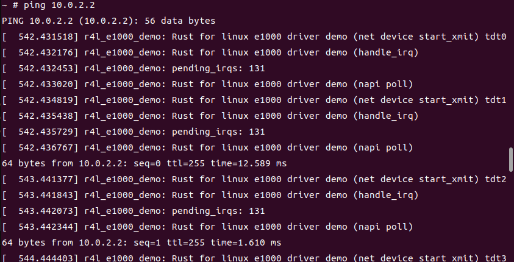
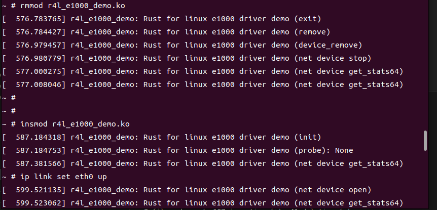
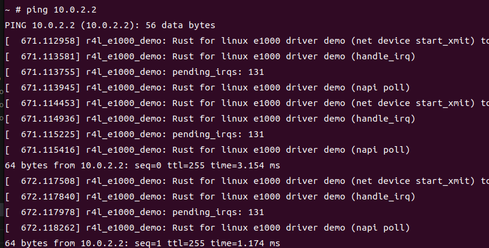
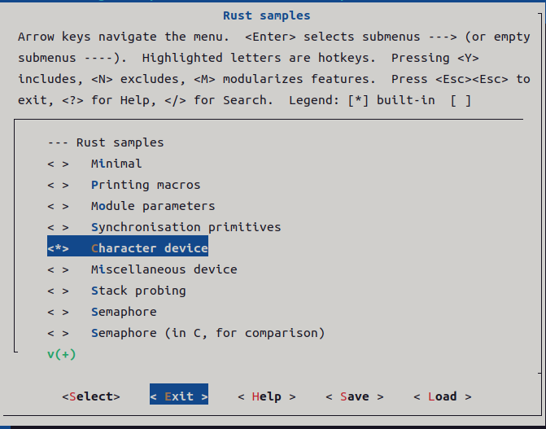
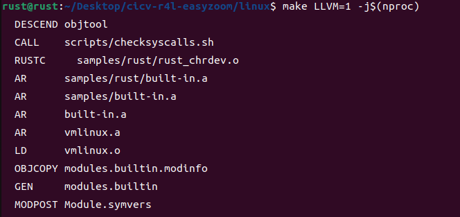
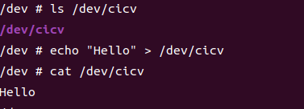

# 第二阶段rust for linux课程作业

## 实验环境：

vmware+ubuntu22.04

## 作业一：

1.编译内核架构


2.设置内核支持RUST


3.编译内核


## 作业二：

### 问题解答:

1、编译成内核模块，是在哪个文件中以哪条语句定义的？
Kbuild的obj-m := r4l_e1000_demo.o

2、该模块位于独立的文件夹内，却能编译成Linux内核模块，这叫做out-of-tree module，请分析它是如何与内核代码产生联系的?
模块的Makefile需要引用Linux内核的编译系统和配置,并指定了KERNELDIR指向内核源代码树的位置,同时使用内核提供的网卡接口数据结构。编译生成的模块ko文件包含了对内核的引用信息。ko文件中的符号绑定和重定位信息会链接到内核代码。

### 实验内容:
1.编译网卡模块:


2.禁用C版本的e1000网卡驱动


3.qemu模拟器中加载r4l_e1000_demo.ko


4.配置网卡


5.ping 10.0.2.2网络


## 作业三：

添加rust_helloworld.rs并修改Makefile和Kconfig，编译内核架构


编译rust_helloworld.ko模块


加载rust_helloworld.ko模块


## 作业四

qemu模拟器中加载r4l_e1000_demo.ko并ping 10.0.2.2网络



卸载r4l_e1000_demo模块并重新装载r4l_e1000_demo模块



重新ping 10.0.2.2网络



代码部分：

```
    fn stop(_dev: &net::Device, _data: &NetDevicePrvData) -> Result {
        pr_info!("Rust for linux e1000 driver demo (net device stop)\n");
        
        Self::e1000_free_all_tx_resources(_data);
        Self::e1000_free_all_rx_resources(_dev, _data);

        let raw_ptr = _data._irq_handler.load(core::sync::atomic::Ordering::Relaxed);
        if !raw_ptr.is_null() {
            let boxed_reg = unsafe {Box::from_raw(raw_ptr as *mut kernel::irq::Registration<E1000InterruptHandler>)};
        }
        _dev.netif_stop_queue();
        _dev.netif_carrier_off();
        _data.e1000_hw_ops.e1000_reset_hw();
        _data.napi.disable();
        Ok(())
    }

    fn remove(data: &Self::Data) {
        pr_info!("Rust for linux e1000 driver demo (remove)\n");
        let bars = data.bars;
        let pci_dev_ptr = data.pci_dev_ptr;

        unsafe { bindings::pci_release_selected_regions(pci_dev_ptr, bars) };
        unsafe { bindings::pci_clear_master(pci_dev_ptr) };
        unsafe { bindings::pci_disable_device(pci_dev_ptr) };
        data.e1000_hw_ops.as_arc_borrow().e1000_reset_hw();
        
    }
```

## 作业五

修改配置



编编译内核



往字符设备写入和读出内容



### 问题解答:

作业5中的字符设备/dev/cicv是怎么创建的？它的设备号是多少？它是如何与我们写的字符设备驱动关联上的？

在src_e1000目录里的build_image.sh， echo "mknod /dev/cicv c 248 0" >> etc/init.d/rcS；通过启动脚本/etc/init.d/rcS初始化任务，随后通过mknod /dev/节点名称 c 主设备号 次设备号方式创建设备节点，所以/dev/cicv的主设备号是248，次设备号是0；通过设备号248进行关联的