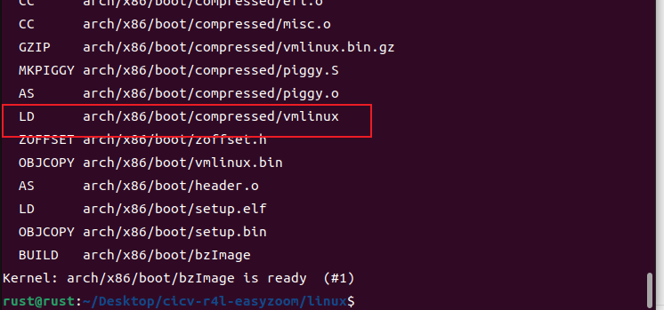
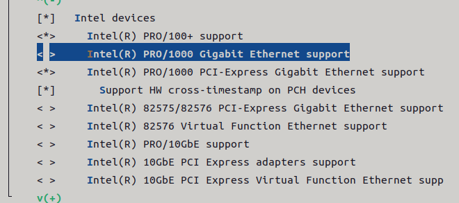
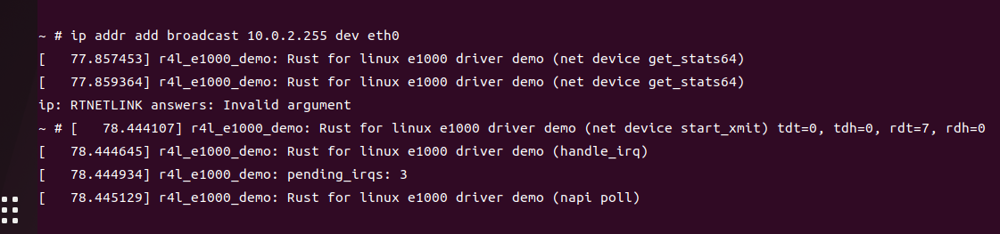
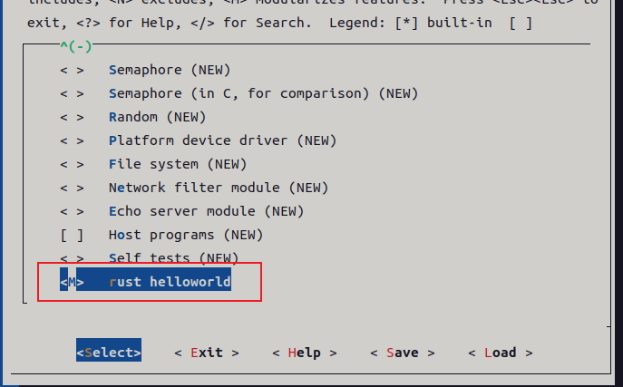

# 第二阶段rust for linux课程作业

## 实验环境：

vmware+ubuntu22.04

## 作业一：

1.编译内核架构

2.设置内核支持RUST

3.编译内核

## 作业二：

### 问题解答:

1、编译成内核模块，是在哪个文件中以哪条语句定义的？
Kbuild的obj-m := r4l_e1000_demo.o

2、该模块位于独立的文件夹内，却能编译成Linux内核模块，这叫做out-of-tree module，请分析它是如何与内核代码产生联系的?
模块的Makefile需要引用Linux内核的编译系统和配置,并指定了KERNELDIR指向内核源代码树的位置,同时使用内核提供的网卡接口数据结构。编译生成的模块ko文件包含了对内核的引用信息。ko文件中的符号绑定和重定位信息会链接到内核代码。

### 实验内容:
1.编译网卡模块:

2.禁用C版本的e1000网卡驱动

3.qemu模拟器中加载r4l_e1000_demo.ko

4.配置网卡

5.ping 10.0.2.2网络

## 作业三：

添加rust_helloworld.rs并修改Makefile和Kconfig，编译内核架构

编译rust_helloworld.ko模块

加载rust_helloworld.ko模块

## 作业四

## 作业五

修改配置

编编译内核

往字符设备写入和读出内容

### 问题解答:

作业5中的字符设备/dev/cicv是怎么创建的？它的设备号是多少？它是如何与我们写的字符设备驱动关联上的？

在src_e1000目录里的build_image.sh， echo "mknod /dev/cicv c 248 0" >> etc/init.d/rcS；通过启动脚本/etc/init.d/rcS初始化任务，随后通过mknod /dev/节点名称 c 主设备号 次设备号方式创建设备节点，所以/dev/cicv的主设备号是248，次设备号是0；通过设备号248进行关联的